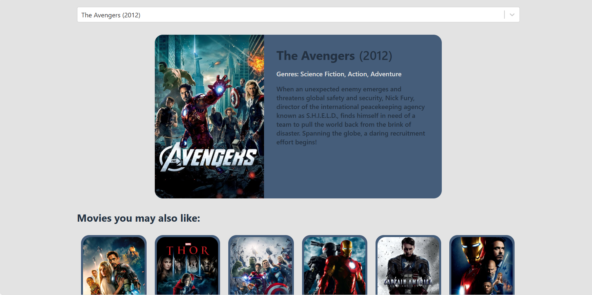

# Movie-Database App

## Introduction

Welcome to the Movie Database App! This is a React-based web application that allows users to search for movies, get recommendations, and explore details about their favorite films.

The primary goal of this project is to provide users with an easy and interactive way to discover movies, based on their preferences and the latest recommendations. The app leverages the [The Movie Database (TMDb) API](https://www.themoviedb.org/documentation/api) to fetch movie data, including details, recommendations, and search results.

## Preview



## Features

- **Movie Search**: Users can search for movies using a search bar that provides hints as they type. The app utilizes the AsyncPaginate component to efficiently handle asynchronous loading of search results.

- **Movie Recommendations**: When a movie is selected, the app displays a list of recommended movies that the user might like.

- **Detailed Movie Information**: Users can click on a recommended movie to view detailed information about that movie.

- **Further Recommendations**: The app provides additional recommendations based on the newly selected movie, helping users explore similar films.

## Technologies

- **React**: The front-end of the application is built using React, a popular JavaScript library for building user interfaces.

- **The Movie Database (TMDb) API**: We use the TMDb API to fetch movie data, including search results, details, and recommendations.

## Setup

To run this project locally, follow these steps:

1. Install dependencies:

```
npm install
```

2. Copy the `.env.sample` file to `.env.local`:

```
cp .env.sample .env.local
```

3. Obtain an API key from [The Movie Database (TMDb)](https://www.themoviedb.org/documentation/api) by signing up for an account and following their API documentation.

4. Open the `.env.local` file and replace the value of `REACT_APP_THEMOVIEDB_API_KEY` with your actual TMDb API key.

5. Start the development server:

```
npm start
```

6. Open your browser and navigate to [http://localhost:3000](http://localhost:3000) to use the app.

